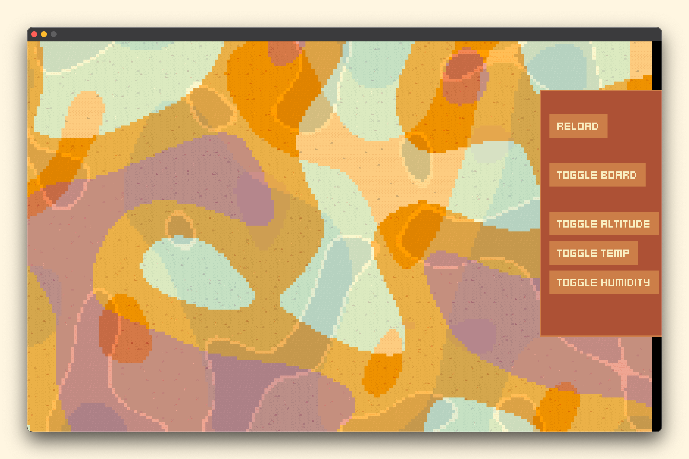
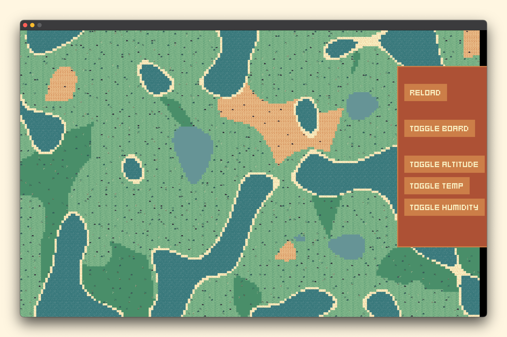

# Kingdoms

A strategy game written in Go and Ebitengine.

https://raw.githubusercontent.com/m110/kingdoms/refs/heads/master/.github/video.mp4

## Sandbox (terrain generation)

## Layers

* Domain — should be Kingdoms-specific data.

## Render system

There are two kinds of render area:

* Board - all elements affected by the camera. They are rendered in chunks.
* UI - all elements that are not affected by the camera. They are rendered in one piece, with absolute position.
